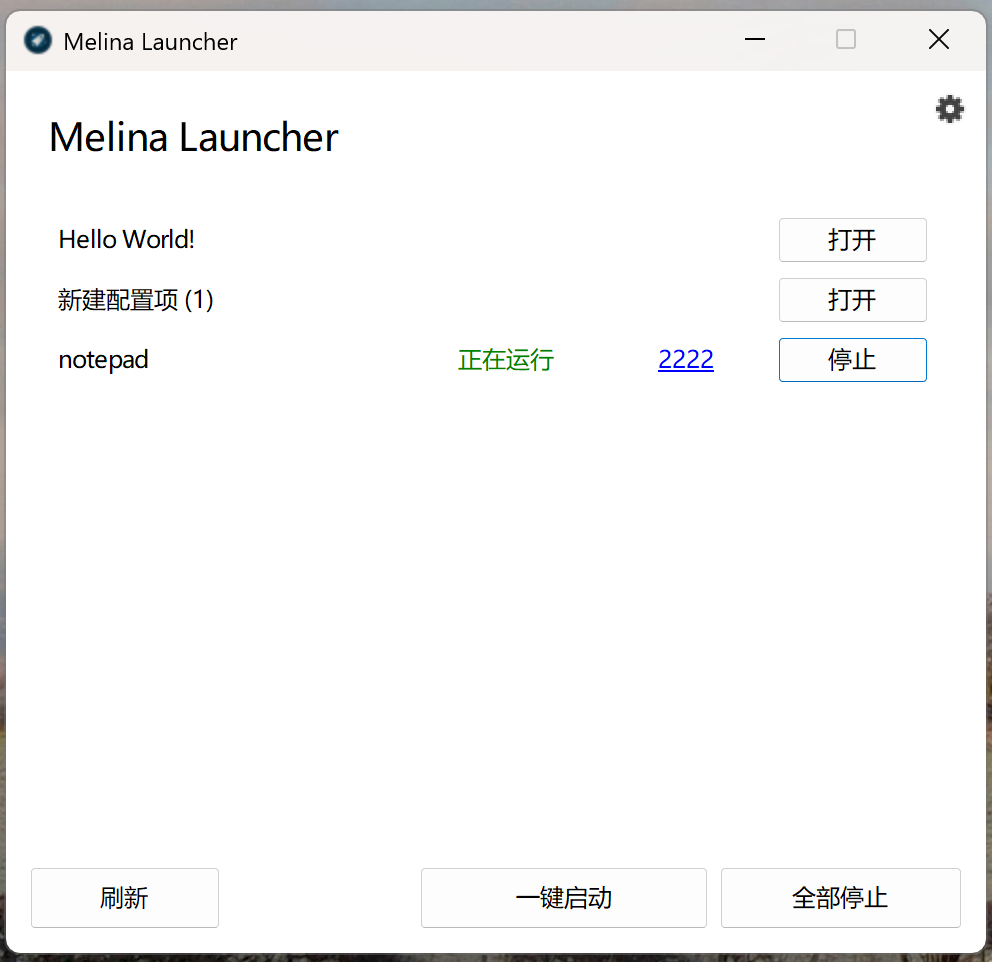
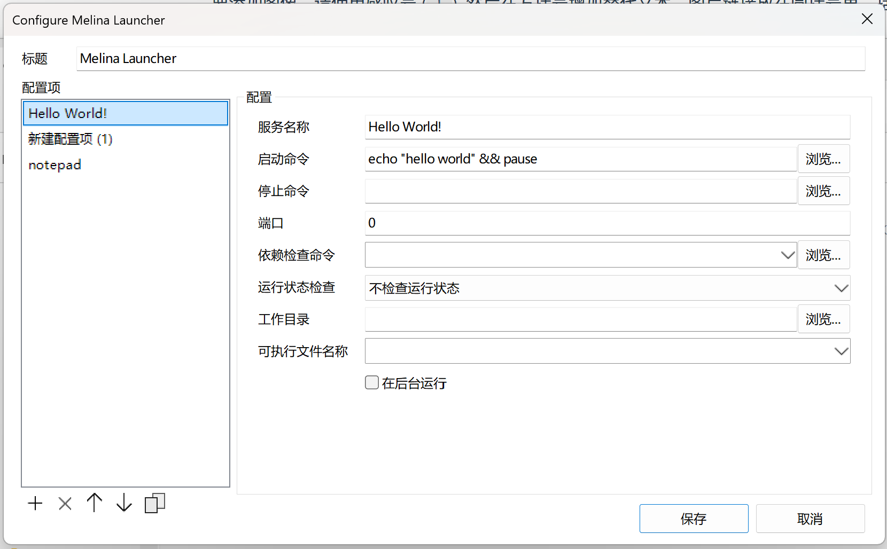
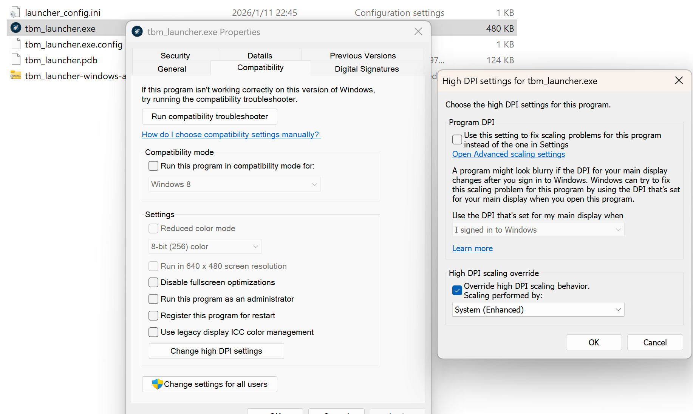

# Melina Launcher

## Screenshot

## Enable High DPI

To enable high DPI, use windows system's High DPI setting.

1. Select **Properties** -> **Compatiblity** -> **Change high DPI settings** .

2. Check **Override high DPI scaling behavior**.

3. Select **System (Enhanced)**.

------------------------

Created by Melina in Nov 2020